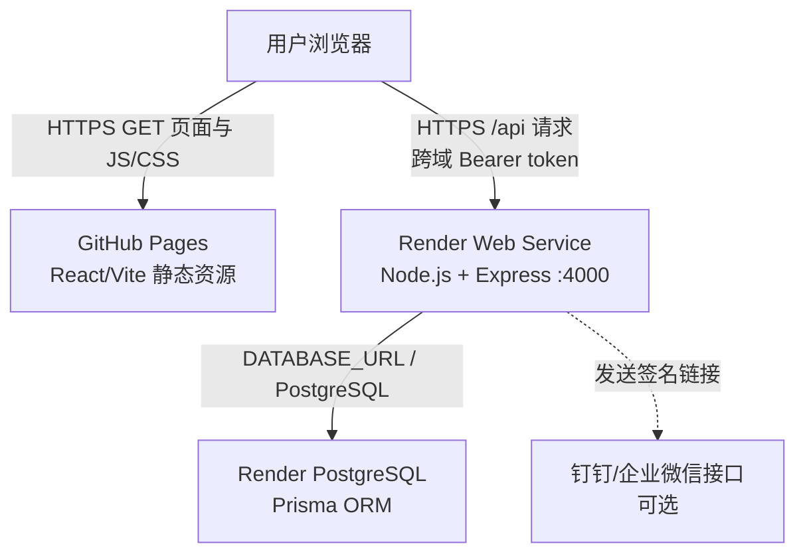
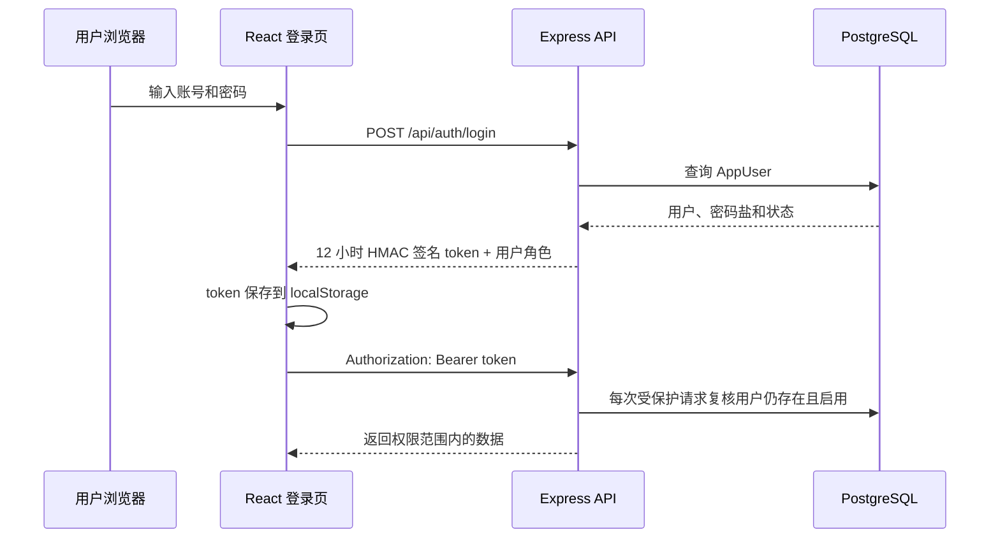

# XJD Finance 当前架构审计

> 审计日期：2026-07-21
> 审计范围：`cross-border-finance-mvp` 当前 `main` 分支（版本 `c6cdca3`）
> 本文只记录现状、依赖和风险，不修改财务计算、API 路径、Prisma 数据模型或部署配置。

## 1. 审计结论

当前生产系统采用前后端分离部署：GitHub Pages 托管 React 静态文件，用户浏览器直接调用 Render 上的 Express API，Render API 再通过 `DATABASE_URL` 访问 Render PostgreSQL。GitHub Pages 不代理 API 请求。

仓库已经具备 PostgreSQL Prisma schema、迁移基线、Render Blueprint、GitHub Pages 工作流、健康检查和一个可同时打包前后端的 Dockerfile，但还不具备附件目标中的企业局域网生产部署能力。主要缺口是生产 Compose、Nginx、HTTPS、数据库持久卷、数据库备份/恢复脚本，以及安全的独立管理员初始化流程。

现有 Dockerfile 不能直接作为腾讯云或局域网生产镜像：它在构建阶段执行数据库部署，给 PostgreSQL schema 配置了 SQLite URL，并尝试把 `prisma/dev.db` 复制到运行镜像。这些行为必须在下一阶段修复，但本阶段未改动。

## 2. 项目目录结构

| 范围 | 位置 | 作用 |
| --- | --- | --- |
| 前端 | `client/` | React 18、TypeScript、Vite 5、Ant Design、React Router、Axios |
| 前端入口 | `client/src/main.tsx`、`client/src/App.tsx` | 初始化应用、Hash Router、认证和月份上下文 |
| 前端 API | `client/src/api/` | Axios 客户端、Bearer token、各业务模块请求和鉴权下载 |
| 后端 | `server/` | Node.js 22、Express 4、TypeScript、Prisma API 服务 |
| 后端入口 | `server/src/index.ts`、`server/src/app.ts` | HTTP 服务、超时、优雅退出、CORS、认证、路由和静态文件服务 |
| 后端路由 | `server/src/routes/` | `/api/auth`、`/api/finance`、`/api/workflow` 等现有 API |
| 数据访问 | `server/src/prisma/client.ts`、`server/src/repositories/` | PrismaClient 和业务仓储 |
| Prisma schema | `prisma/schema.prisma` | PostgreSQL 数据源和 27 个业务模型 |
| Prisma 迁移 | `prisma/migrations/20260720000100_baseline/` | 当前唯一迁移基线 |
| Prisma 兼容部署 | `scripts/deploy-prisma-schema.ts` | 新库执行 migrate deploy；旧库无迁移历史时先 db push 再登记基线 |
| 本地启动 | `scripts/dev.mjs`、`start-finance-local.ps1` | 同时启动前端 5173 和后端 4000；PowerShell 脚本会先同步数据库 |
| 当前 Docker | `Dockerfile`、`.dockerignore` | 构建前后端并由 Express 提供静态页面；尚无生产 Compose/Nginx |
| Render 部署 | `render.yaml` | Render Web Service 与 Render PostgreSQL Blueprint |
| GitHub Pages | `.github/workflows/pages.yml` | 构建服务端产物，注入线上 API 地址，构建并发布前端 |
| 部署说明 | `README.md`、`docs/deployment-github.md`、`docs/06-cloud-deployment-notes.md` | 当前本地、GitHub Pages、Render 和单容器说明 |

### 当前不存在的目标文件

- `docker-compose.prod.yml`
- `nginx/default.conf`
- `.env.production`（正确做法是不提交真实生产文件，只提交示例）
- `scripts/deploy.sh`
- `scripts/backup.sh`
- `scripts/init-admin.ts`
- 腾讯云/局域网专用部署与恢复文档

## 3. 当前生产架构



说明：附件中的“GitHub Pages → Render API”是逻辑关系。网络上实际是浏览器分别访问 GitHub Pages 和 Render，GitHub Pages 不具备反向代理能力。

### 线上核验

2026-07-21 实际检查结果：

- GitHub Pages 首页返回 HTTP 200。
- Render `/api/health` 返回 `status: ok`。
- Render `/api/health/ready?month=2026-07` 返回 HTTP 200 和 `status: ready`。
- 数据库、导入模板、参数规则和月度汇总检查均通过。
- Render 报告的运行版本为 `c6cdca31e3903bcdd8add6a79b26c9292c4cf8f1`。

## 4. 当前运行方式

### 4.1 本地开发

推荐入口：

```powershell
.\start-finance-local.ps1
```

脚本执行顺序：

1. 释放 4000 和 5173 端口（可用 `-NoRestartPorts` 禁止）。
2. 执行 `pnpm prisma:deploy`。
3. 启动后端 `pnpm --filter cross-border-finance-server dev`。
4. 注入 `VITE_API_BASE_URL=http://localhost:4000/api` 并启动 Vite。

也可以运行：

```bash
pnpm dev
```

该命令只并行启动前后端，不会先执行数据库迁移。

本地地址：

- 前端：`http://localhost:5173/`
- 后端：`http://localhost:4000/api`
- 健康检查：`http://localhost:4000/api/health`

审计时 5173、4000 和 5432 均未监听，因此“配置的本地地址”和“当前正在运行的服务”不能混为一谈。

### 4.2 GitHub Pages 前端

`.github/workflows/pages.yml` 在 `main` 分支推送后执行：

1. Node.js 22 + pnpm 9 安装依赖。
2. 生成 Prisma Client，并验证运维辅助逻辑。
3. 构建后端并上传服务器产物。
4. 使用以下构建时变量构建前端：
   - `VITE_API_BASE_URL=https://cross-border-finance-server.onrender.com/api`
   - `VITE_PUBLIC_APP_URL=https://jiayinz906-lang.github.io/cross-border-finance-mvp/`
5. 将 `client/dist` 发布到 GitHub Pages。

Vite 根据 `GITHUB_REPOSITORY` 自动把静态资源基础路径设为 `/cross-border-finance-mvp/`。前端使用 Hash Router，因此业务路由位于 `/#/...`。

### 4.3 Render 后端

`render.yaml` 定义：

- Web Service：`cross-border-finance-server`，Node runtime，当前 `plan: free`。
- PostgreSQL：`cross-border-finance-db`，当前 `plan: free`。
- 构建命令：`pnpm install --frozen-lockfile && pnpm build:render`。
- 启动命令：`pnpm start:render`。
- 健康检查：`/api/health`。

`pnpm build:render` 当前执行数据库结构部署、前端构建和后端构建。Express 在 `client/dist` 存在时也可从 Render 根路径提供前端静态文件，但当前对外主前端仍是 GitHub Pages。

## 5. 请求与数据流

### 5.1 页面和 API 请求

1. 浏览器从 GitHub Pages 下载 `index.html`、JavaScript 和 CSS。
2. 前端 Axios 使用构建期 `VITE_API_BASE_URL` 指向 Render `/api`。
3. 登录后，前端从 `localStorage` 读取 `xjd-finance-token`，附加 `Authorization: Bearer <token>`。
4. Express 依次执行 CORS、JSON 解析、请求日志、token 认证和业务路由。
5. Controller 调用 service/repository，repository 使用 PrismaClient 查询 PostgreSQL。
6. JSON 或鉴权文件响应返回浏览器。

### 5.2 Excel 导入数据流

1. 前端上传 Excel 到内存型 Multer，当前默认上限 25 MB。
2. 后端先做预览和财务质量校验。
3. 确认导入后，将原始 Excel 文件、原始行、标准费用行、订单和汇总写入 PostgreSQL。
4. `RawLedgerLine` 和 `FinanceChargeLine` 是财务追溯来源。
5. 原始 Excel 文件本体和图片凭证以 PostgreSQL `Bytes` 字段保存，不依赖 Render 本地磁盘。

### 5.3 登录流程



生产模式要求 `AUTH_REQUIRE_TOKEN=true`、`ALLOW_HEADER_ROLE=false`。当前公开接口包括健康/就绪检查、登录，以及一次性签名 token 的查看和提交接口。`/api/health/status` 仍需登录。

空用户库当前不是由独立初始化脚本创建管理员，而是在首次登录触发时读取 `BOOTSTRAP_ADMIN_PASSWORD` 并创建管理员。开发环境还保留一组由 `ENABLE_LEGACY_DEFAULT_USERS=true` 才能开启的硬编码旧账号。

### 5.4 数据库访问与迁移流程

- `prisma/schema.prisma` 的 provider 已固定为 `postgresql`。
- 后端通过单例 `PrismaClient` 读取 `DATABASE_URL`。
- 当前有一个 `20260720000100_baseline` 迁移。
- 新数据库或已有迁移历史的数据库执行 `prisma migrate deploy`。
- 若检测到业务表存在但 `_prisma_migrations` 不存在，兼容脚本会执行 `prisma db push --accept-data-loss`，然后把基线标为已应用。
- Render 构建阶段当前会调用上述兼容脚本。

## 6. 环境变量清单

### 6.1 前端构建变量

| 变量 | 当前用途 |
| --- | --- |
| `VITE_API_BASE_URL` | Axios API 根地址；本地为 `http://localhost:4000/api`，GitHub Pages 为 Render API |
| `VITE_PUBLIC_APP_URL` | 生成可外发签名链接时使用的前端公开地址 |
| `GITHUB_REPOSITORY` | Vite 计算 GitHub Pages 子路径 |

### 6.2 后端生产运行变量

| 变量 | 必需性 | 当前用途 |
| --- | --- | --- |
| `DATABASE_URL` | 生产必需 | PostgreSQL 连接字符串 |
| `NODE_ENV` | 生产必需 | 启用生产安全校验 |
| `PORT` | 可选，默认 4000 | Express 监听端口 |
| `AUTH_TOKEN_SECRET` | 生产必需 | HMAC token 签名密钥 |
| `AUTH_REQUIRE_TOKEN` | 生产必须为 `true` | 是否强制 Bearer token |
| `ALLOW_HEADER_ROLE` | 生产必须为 `false` | 是否信任测试角色请求头 |
| `CORS_ALLOWED_ORIGINS` | 必需 | 允许访问私有 API 的前端源，逗号分隔 |
| `PUBLIC_APP_URL` | 必需 | 后端生成公开签名链接的网页根地址 |
| `BOOTSTRAP_ADMIN_USERNAME` | 首次初始化使用 | 初始管理员账号名 |
| `BOOTSTRAP_ADMIN_DISPLAY_NAME` | 首次初始化使用 | 初始管理员显示名 |
| `BOOTSTRAP_ADMIN_PASSWORD` | 空库首次初始化必需 | 初始管理员密码 |
| `ENABLE_LEGACY_DEFAULT_USERS` | 仅本地兼容 | 是否启用旧测试账号，生产必须关闭 |
| `UPLOAD_MAX_MB` | 可选，默认 25 | Excel 单文件上限 |
| `IMAGE_UPLOAD_MAX_MB` | 可选，默认 10 | 单张凭证图片上限 |
| `HEALTH_DB_TIMEOUT_MS` | 可选，默认 5000 | 数据库健康检查超时 |
| `SLOW_REQUEST_THRESHOLD_MS` | 可选，默认 2000 | 慢请求阈值 |
| `HTTP_REQUEST_TIMEOUT_MS` | 可选，默认 120000 | HTTP 请求超时 |
| `CONFIRMATION_FONT_PATH` | PDF/PNG 导出需要 | 中文确认单字体路径 |
| `PDFTOPPM_PATH` | 可选 | `pdftoppm` 可执行文件路径 |

### 6.3 消息通知变量

- `DINGTALK_APP_KEY`
- `DINGTALK_APP_SECRET`
- `DINGTALK_ROBOT_CODE`
- `DINGTALK_WEBHOOK_URL`
- `DINGTALK_WEBHOOK_SECRET`
- `WECOM_WEBHOOK_URL`

这些凭证只能保存在服务器环境变量或密钥管理服务中，不得写入 Git。

### 6.4 运维、验证和元数据变量

- 构建版本：`RENDER_GIT_COMMIT`、`GITHUB_SHA`
- 生产种子保护：`ALLOW_PRODUCTION_SEED`
- 备份：`BACKUP_MONTH`、`BACKUP_OUTPUT_DIR`、`DB_BACKUP_OUTPUT_DIR`、`SQLITE_DB_PATH`
- 验证脚本：`FINANCE_DOCTOR_*`、`VERIFY_*`、`UI_SMOKE_*`、`IMPORT_VERIFY_FILE`

## 7. 当前部署依赖

| 依赖 | 当前版本/来源 | 作用 |
| --- | --- | --- |
| Node.js | 22 | 前后端构建和后端运行 |
| pnpm | 9（CI），Corepack（Docker） | monorepo 依赖和脚本 |
| PostgreSQL | Render 托管，目标待定 | 唯一生产数据库 |
| Prisma | 5.22 | ORM、Client 生成和迁移 |
| OpenSSL / CA 证书 | Docker 系统包 | Prisma/TLS |
| SimHei 字体 + fontconfig | 仓库字体与 Docker 系统包 | 中文 PDF/PNG 确认单 |
| Poppler `pdftoppm` | Docker 系统包 | PDF 转 PNG |
| Sharp | npm 原生依赖 | 图片生成和处理 |
| GitHub Actions / Pages | GitHub | 前端 CI/CD 和静态托管 |
| Render Web Service | Render | Express API |
| Render PostgreSQL | Render | 生产数据持久化 |
| 钉钉/企业微信 | 可选外部服务 | 发送员工签名链接 |

目标腾讯云/局域网方案还需要：Docker Engine、Docker Compose v2、Nginx、TLS 证书、DNS（公网 HTTPS 时）、防火墙、持久化磁盘、备份存储和恢复演练。

## 8. 风险清单

### P0：迁移前必须解决

1. **Docker 构建会接触数据库。** 当前 Dockerfile 执行 `pnpm prisma:deploy`，不满足“镜像构建不可修改数据库”的要求，且会让构建依赖外部数据库可达性。
2. **Docker 数据库类型冲突。** Dockerfile 设置 `DATABASE_URL=file:./dev.db`，但 Prisma provider 已是 PostgreSQL；它还尝试复制 `prisma/dev.db`。当前镜像定义与代码现状不一致。
3. **没有目标生产编排。** 当前无 `docker-compose.prod.yml`、PostgreSQL 持久卷、Nginx 或容器级健康依赖，不能直接部署到公司内网或腾讯云。
4. **没有 PostgreSQL 自动备份与恢复流程。** 现有 `backup:db` 是历史 SQLite 文件复制，不是生产 PostgreSQL 备份。

### P1：生产切换前解决

1. **兼容迁移含 `--accept-data-loss`。** 已有数据库无迁移历史时会先 `db push --accept-data-loss`。迁移 Render 生产数据前必须先做 `pg_dump`、校验和恢复演练，不能在目标生产库盲目执行。
2. **数据库迁移发生在 Render 构建阶段。** 构建与迁移耦合，不利于失败回滚、锁控制和多实例部署，应拆成显式发布步骤。
3. **管理员初始化仍耦合首次登录。** 附件要求独立 `init-admin` 脚本；当前空库在登录请求中创建管理员，审计和操作边界不够清晰。
4. **仓库仍包含硬编码旧测试账号。** 虽然仅在非生产且显式开启时生效，仍应在生产改造阶段移除，避免环境误配。
5. **缺少登录限流和暴力破解保护。** 当前密码采用 PBKDF2，但登录接口未看到反向代理或应用层限流。
6. **token 保存于 localStorage。** 若前端发生 XSS，token 可能被读取；后续公网 SaaS 化应评估 HttpOnly Cookie、CSP 和 token 轮换。
7. **无生产安全响应头配置。** 当前未配置 Nginx/Helmet 的 CSP、HSTS、`X-Content-Type-Options` 等策略。
8. **同域切换需要同步配置。** 目标 `/api` 方案需要同时调整前端构建变量、`PUBLIC_APP_URL`、CORS 和 Nginx 代理，不能只改一个变量。

### P2：容量和运维风险

1. **原始 Excel 和图片保存在 PostgreSQL。** 它保证追溯和容器无状态，但数据库、WAL 和备份体积会持续增长，需要容量指标、保留策略和恢复时间目标。
2. **现有上传上限与目标不一致。** 应用默认 Excel 25 MB，而目标 Nginx 要允许 50 MB；Nginx 上限只能是外层上限，应用上限也必须明确决定。
3. **Render Blueprint 使用 free 套餐。** 免费实例可能休眠或受生命周期/容量限制，不适合作为长期财务生产环境。
4. **前后端当前由两个平台发布。** GitHub Pages 和 Render 发布可能短暂版本不一致；同域 Docker 部署可减少这一风险，但必须保留可回滚镜像。
5. **就绪检查不是完整业务巡检。** 当前会验证数据库、模板和参数规则，并允许无月度汇总的新环境就绪；部署后仍需单独执行业务验收。
6. **文档存在历史口径。** README 仍出现本地 SQLite 描述，而当前 Prisma provider 已固定 PostgreSQL，迁移文档必须统一。

## 9. 已有可复用能力

- Express 已能在 `client/dist` 存在时同时提供前端静态文件和 API。
- 前端在没有 `GITHUB_REPOSITORY` 时使用根路径 `/`，适合未来同域部署。
- 前端 API 地址已经完全由 `VITE_API_BASE_URL` 控制。
- 后端生产环境会校验 `AUTH_TOKEN_SECRET`、`DATABASE_URL`、`AUTH_REQUIRE_TOKEN` 和 `ALLOW_HEADER_ROLE`。
- 请求日志只记录脱敏路径、状态、耗时和 request ID，不打印 Authorization header 或请求体。
- 已有 `/api/health` 和 `/api/health/ready`，可直接用于 Docker/Nginx 健康检查设计。
- 已有 PostgreSQL baseline migration，可作为后续规范化迁移的起点。
- 原始 Excel 和图片凭证存入 PostgreSQL，容器不需要业务文件持久卷；PostgreSQL 数据卷和备份仍是必需项。

## 10. 下一阶段建议范围（等待确认后执行）

第二阶段只处理部署边界，不改业务逻辑：

1. 规范 `.env.example`，为同域生产明确 `VITE_API_BASE_URL=/api`，但不提交真实 `.env.production`。
2. 重写生产 Dockerfile 为独立的前端构建、后端构建和最小运行阶段，构建阶段不连接数据库。
3. 新增 `docker-compose.prod.yml`、Nginx 配置和容器健康检查。
4. 把 `prisma migrate deploy` 移到显式部署步骤。
5. 增加 PostgreSQL 备份/恢复脚本和独立管理员初始化脚本。
6. 先在全新本地 PostgreSQL 上演练，再迁移 Render 数据；任何生产迁移前先做可恢复备份。

在用户确认进入第二阶段前，不执行上述改造。
