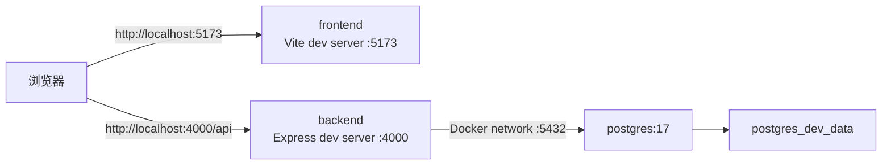
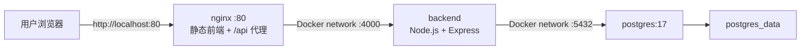

# XJD Finance Docker 架构与操作说明

> 第二阶段范围：本地/腾讯云可复用的 Docker 基础架构。当前仅启用 HTTP，域名、DNS 和 HTTPS 留到第三阶段；Render PostgreSQL 数据迁移与正式备份恢复留到第四阶段。

## 1. 容器结构

### 开发模式



开发模式保留 Vite 和 `tsx watch`，`client/src`、`server/src` 使用只读/读写绑定挂载，修改源码后容器内开发服务自动更新。

### 生产模式



生产模式只向宿主机开放 Nginx。Backend 仅在 Compose 内部网络暴露 4000，PostgreSQL 不开放宿主机端口。

## 2. Dockerfile 阶段

| 阶段 | 用途 | 是否连接数据库 |
| --- | --- | --- |
| `dependencies` | 安装 pnpm 依赖并生成 Prisma Client | 否 |
| `development` | 提供前后端开发运行环境 | 否 |
| `frontend-build` | 构建 `client/dist` | 否 |
| `backend-build` | 构建 `server/dist` | 否 |
| `frontend-runtime` | Nginx 提供 React 静态文件并代理 `/api` | 否 |
| `backend-runtime` | 运行 `node server/dist/index.js` | 启动后通过运行时 `DATABASE_URL` 连接 |

镜像构建过程不会执行 `prisma db push`、`prisma migrate deploy` 或任何数据库写入。Compose 启动时由一次性 `migrate` 服务在 PostgreSQL 健康后执行 `prisma migrate deploy`，成功后才启动 Backend。

## 3. 端口

| 服务 | 容器端口 | 开发模式宿主机 | 生产模式宿主机 |
| --- | --- | --- | --- |
| Frontend/Nginx | 5173 / 80 | `127.0.0.1:5173` | `${HTTP_PORT:-80}` |
| Backend | 4000 | `127.0.0.1:4000` | 不直接开放 |
| PostgreSQL | 5432 | `127.0.0.1:${POSTGRES_DEV_PORT:-54320}` | 不直接开放 |

生产同域访问：

- 页面：`http://localhost/`
- API：`http://localhost/api`
- 健康检查：`http://localhost/api/health`
- 就绪检查：`http://localhost/api/health/ready?month=YYYY-MM`

## 4. 环境文件

仓库只提交示例，不提交实际环境文件：

- 本机非 Docker：`.env.example` → `.env`
- Docker 开发：`.env.docker.example` → `.env.docker`
- Docker 生产：`.env.production.example` → `.env.production`

复制后必须替换所有 `CHANGE_ME`，并确保 `POSTGRES_PASSWORD` 与 `DATABASE_URL` 中的密码一致。密码包含特殊字符时，`DATABASE_URL` 中必须进行 URL 编码。

生成随机 token 示例：

```powershell
[Convert]::ToHexString([Security.Cryptography.RandomNumberGenerator]::GetBytes(32)).ToLower()
```

## 5. 首次启动开发环境

```powershell
Copy-Item .env.docker.example .env.docker
# 编辑 .env.docker，替换全部 CHANGE_ME
docker compose --env-file .env.docker -f docker-compose.dev.yml up -d --build
docker compose --env-file .env.docker -f docker-compose.dev.yml ps
```

`migrate` 容器正常执行后会显示为 `Exited (0)`，这是一次性迁移任务成功完成的预期状态。

打开：

```text
http://localhost:5173/
```

开发数据库只在新的 `postgres_dev_data` 卷首次创建时加载仓库已有 baseline SQL。它不会连接或修改 Render PostgreSQL。

## 6. 首次启动本地生产模式

```powershell
Copy-Item .env.production.example .env.production
# 编辑 .env.production，替换全部 CHANGE_ME
docker compose --env-file .env.production -f docker-compose.prod.yml up -d --build
docker compose --env-file .env.production -f docker-compose.prod.yml ps
```

每次启动会先检查并应用仓库中尚未执行的 Prisma migration；已执行的 migration 不会重复写入。

打开：

```text
http://localhost/
```

新的空数据库卷会在 PostgreSQL 官方镜像第一次初始化时加载已有 baseline SQL。该机制只为第二阶段的全新本地数据库验证服务，不会迁移 Render 生产数据，也不替代后续 Prisma migration 发布流程。

## 7. 健康与功能验证

```powershell
Invoke-RestMethod http://localhost/api/health
Invoke-RestMethod 'http://localhost/api/health/ready?month=2026-07'
```

首次登录会在空用户表中使用环境文件里的 `BOOTSTRAP_ADMIN_*` 创建管理员，并要求修改初始密码。

登录接口验证：

```powershell
$body = @{
  username = 'admin'
  password = '<BOOTSTRAP_ADMIN_PASSWORD>'
} | ConvertTo-Json

$login = Invoke-RestMethod \
  -Uri http://localhost/api/auth/login \
  -Method Post \
  -ContentType 'application/json' \
  -Body $body
```

Dashboard 接口验证：

```powershell
Invoke-RestMethod \
  -Uri 'http://localhost/api/finance/dashboard?month=2026-07' \
  -Headers @{ Authorization = "Bearer $($login.token)" }
```

全新数据库没有 Excel 业务数据时，Dashboard 返回空月份状态是正常结果；业务数据必须继续通过系统 Excel 导入流程写入。

全新空库在尚未录入表头模板和参数规则时，`/api/health/ready` 会返回 `503 not_ready`，并明确显示 `importTemplate=false`、`parameterRules=false`。这表示业务初始化尚未完成，不代表 PostgreSQL 断开；基础存活检查以 `/api/health` 和容器 healthcheck 为准。

## 8. 停止与删除

暂停容器并保留容器、网络和数据：

```powershell
docker compose --env-file .env.production -f docker-compose.prod.yml stop
```

删除容器和网络但保留 PostgreSQL 数据卷：

```powershell
docker compose --env-file .env.production -f docker-compose.prod.yml down
```

重新启动：

```powershell
docker compose --env-file .env.production -f docker-compose.prod.yml up -d
```

## 9. 数据保留规则

- `docker compose down` 不删除命名卷，数据库数据保留。
- `docker compose up -d --build` 不删除命名卷，数据库数据保留。
- PostgreSQL 数据位于 Docker 命名卷 `xjd-finance-prod_postgres_data`。
- 开发数据位于 `xjd-finance-dev_postgres_dev_data`。
- 只有明确执行 `docker compose down -v` 或手工删除 volume 才会删除数据库。
- 对财务系统禁止在未备份时执行 `down -v`、`docker volume rm` 或 Docker Desktop 的全量数据清理。

查看数据卷：

```powershell
docker volume ls --filter name=xjd-finance
```

## 10. PostgreSQL 备份与校验

生产 Docker 数据库手工归档：

```powershell
pnpm backup:db
```

命令调用 PostgreSQL 17 容器中的 `pg_dump --format=custom`，将归档写入宿主机 `outputs/db-backups/`，并生成同名 `.sha256` 和 `.json` 文件。生成后立即用 `pg_restore --list` 检查归档目录；该检查不会写入数据库。

复核最近一次归档：

```powershell
pnpm verify:db-backup
```

开发数据库使用：

```powershell
pnpm backup:db:dev
```

归档文件位于 Docker 数据卷之外，因此即使容器被删除仍然保留。恢复必须先在独立测试库演练；当前脚本不会自动覆盖业务数据库。

## 11. 第二阶段本地验证结果

验证日期：2026-07-21。

| 检查项 | 结果 |
| --- | --- |
| 生产 Compose 配置解析 | 通过 |
| 开发 Compose 配置解析 | 通过 |
| PostgreSQL 17 容器健康检查 | 通过 |
| Backend 容器健康检查 | 通过 |
| Nginx 容器健康检查 | 通过 |
| `http://localhost/` 静态前端 | HTTP 200 |
| `http://localhost/api/health` | `status=ok` |
| 管理员首次登录和强制改密 | 通过 |
| Bearer token Dashboard 请求 | 通过，空库返回空业务结构 |
| `docker compose down` 后重新启动 | 通过，管理员账号仍可登录 |
| PostgreSQL 命名卷 | `xjd-finance-prod_postgres_data`，数据保留 |
| PostgreSQL custom-format 归档 | 通过，归档结构及 SHA-256 已校验 |

本次验证使用全新本地 PostgreSQL 空库，没有连接、导出或修改 Render PostgreSQL。

## 12. 当前阶段边界

本阶段未执行：

- Render PostgreSQL 导出或迁移
- `prisma migrate reset`
- `prisma db push`
- 生产数据库 schema 变更
- 域名、DNS、SSL 证书或 HTTPS
- PostgreSQL 定时备份、异地对象存储和自动恢复演练
- 管理员初始化逻辑重构

这些内容必须按后续阶段分别处理，并在迁移真实财务数据前完成可恢复备份。
